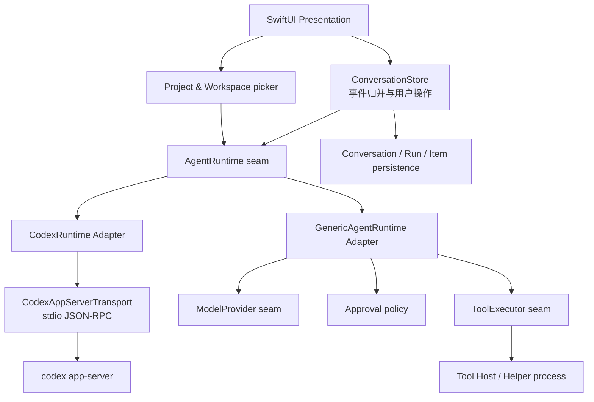
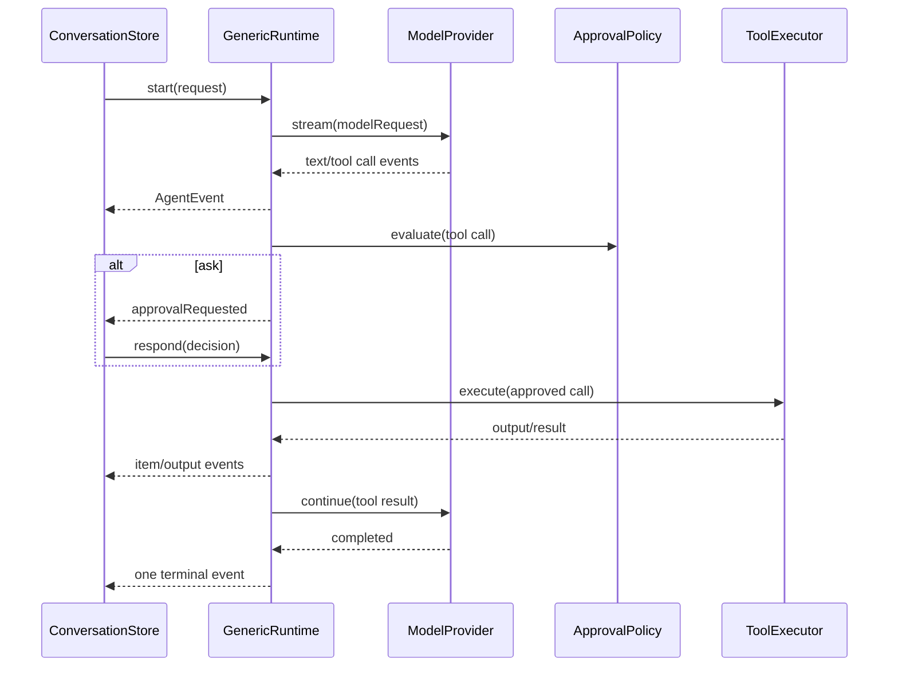

# Disco coding agent 详细实施计划

版本：0.1

日期：2026-08-08

状态：长期路线基线；当前已实现能力以 `AGENTS.md` 和各专项实现记录为准

适用代码基线：`main@531f128`、`codex-cli 0.147.0`

## 1. 文档目的

本文把 `macos-multi-model-agent-plan.md` 中的产品蓝图落成可执行的工程计划，重点回答以下问题：

1. 当前聊天 MVP 距离 macOS 原生 coding agent 还缺什么。
2. 第一条可用链路应按什么顺序实现。
3. `AgentRuntime`、Codex app-server、Generic Runtime、Tool Host、审批、持久化和 SwiftUI 之间如何划分职责。
4. 每个阶段需要修改哪些文件、增加哪些测试，以及何时才算完成。
5. system prompt、`AGENTS.md`、结构化工具和安全策略分别应该放在哪里。

本文是 coding agent 实施阶段的长期细化文档；产品目标、总体架构和 ADR-001～006 仍以 `macos-multi-model-agent-plan.md` 为准。上下文压缩 v1 的当前实现、持久化契约和待补测试以 `context-compaction-implementation-plan.md` 为准；Kimi Code API/ACP 的路线决策以 `kimi-code-integration-research.md` 为准。上述文档发生冲突时：

- 产品边界和长期方向以总蓝图为准。
- 当前代码事实和近期实施顺序以本文为准。
- Codex wire 字段以项目锁定版本运行 `codex app-server generate-json-schema` 生成的 schema 为准，文档示例不能替代生成物。

## 2. 执行结论

近期采用 **Codex-first 的纵向切片**：先把现有 Codex app-server 接入从“可聊天”补齐为“可在指定仓库内读取、执行、修改、审批、展示 diff 并恢复”，再实现 Generic Runtime 的自有工具循环。

第一条必须跑通的用户旅程是：

> 选择仓库 → 创建会话 → 输入“修复失败的测试” → 查看计划和命令 → 审批执行或写入 → 查看实时输出和文件 diff → 取消或完成 → 重启 Disco 后继续该会话。

近期不以 system prompt 编辑器、MCP、多 agent、浏览器工具或完整终端模拟器为先。它们不能替代工作区、Agent 事件、审批和恢复这条核心闭环。

## 3. 当前实现基线

### 3.1 已经具备

| 能力 | 当前实现 | 位置 |
|---|---|---|
| macOS 原生聊天界面 | SwiftUI + AppKit，支持会话侧栏、流式消息和推理展示 | `disco/App/` |
| 多服务商配置 | OpenAI 兼容服务商与 ChatGPT/Codex 订阅配置 | `ProviderConfig.swift`、`SettingsView.swift` |
| Project / Workspace 身份切片 | 可读目录选择、bookmark、Project/Conversation 分组、不可用状态与重新关联；本阶段不传给 Codex | `Workspace.swift`、`AppState.swift`、`ContentView.swift` |
| Generic 文本 Runtime | 消费 `ModelProvider` 文本/推理流，负责指令、上下文压缩、overflow recovery，并保证单一终止事件 | `GenericAgentRuntime.swift`、`ContextCompactor.swift` |
| Token usage 与上下文状态 | Provider/Codex usage、checkpoint、上下文估算和压缩记录 | `ModelContract.swift`、`RuntimeContract.swift`、`ConversationPersistence.swift` |
| Responses Provider | URLSession + SSE，发送历史消息，解析文本、推理、usage 和 context overflow | `OpenAIResponsesProvider.swift` |
| Chat Completions Provider | URLSession + SSE，解析 `content` / `reasoning_content`；当前接入 Kimi Code | `OpenAIChatCompletionsProvider.swift` |
| Codex 子进程与握手 | 启动 `codex app-server`，完成 initialize/initialized | `CodexAppServerTransport.swift` |
| Codex thread/turn | thread start/resume、turn start/interrupt | `CodexAppServerTransport.swift` |
| Codex 文本事件 | agent message delta、reasoning summary delta、turn completed | `CodexRuntime.swift` |
| Codex usage 与上下文压缩 | token usage、自动/手动压缩状态、`thread/compact/start` | `CodexAppServerTransport.swift`、`CodexRuntime.swift` |
| Codex thread 恢复标识 | 本地保存 thread ID，重启后 resume | `ConversationPersistence.swift` |
| 协议测试替身 | 脚本化 `LineProcess`，不依赖真实网络或真实账号 | `CodexAppServerTestSupport.swift` |
| 会话持久化 | SwiftData 保存消息、推理、thread ID 和上下文派生状态 | `ConversationPersistence.swift` |

### 3.2 尚未具备

| 缺口 | 当前表现 | 直接后果 |
|---|---|---|
| Codex workspace 配置 | 当前 Project 的 `WorkspaceContext` 尚未注入 Runtime | Codex 仍不能可靠地知道应操作哪个项目 |
| Codex thread 配置 | `thread/start` 只传 `model` | 没有 `cwd`、sandbox、approval policy |
| 丰富 Agent 事件 | 仍缺少计划、通用 tool item、命令、diff 和审批领域事件 | UI 无法表达 coding-agent 活动 |
| Codex item 解码 | `item/started` / `item/completed` 仍主要只取 id/type | 命令、文件修改等内容被丢弃 |
| Server request | 审批、`requestUserInput` 和工具请求一律返回 `-32601` | 需要审批或用户补充信息的 coding task 会中断或被拒绝 |
| Diff 与命令输出 | 未订阅或映射对应增量事件 | 用户看不到模型实际做了什么 |
| Run 状态 | 只有 `isStreaming` 和消息占位 | 无法表示等待审批、等待工具和取消中状态 |
| 丰富持久化 | 目前只保存消息、推理、thread ID 和上下文派生状态 | 重启后仍会丢失命令、审批、diff 和完整运行上下文 |
| Generic 工具循环 | `ModelEvent` 仍不含可执行 tool call | API Key 模型仍然只是聊天模型 |
| Tool Host | 未实现 | Generic Runtime 无安全的本地执行能力 |

### 3.3 当前最关键的技术债

1. `AgentRunRequest.resumeThreadID` 暴露了 Codex 专有概念，而 `CodexRuntime.Configuration` 已经持有同一信息。最终应把 Runtime 专有恢复状态收回 Adapter 内部。
2. Project/Workspace 当前只提供身份和目录可用性；下一阶段接入 `cwd`、sandbox policy 前，必须重新评估已有 thread resume 的路径安全语义。
3. `ChatMessage.Part.toolCall` 是展示占位，不足以承载命令状态、输出、文件变化、审批和恢复。
4. `ConversationStore` 同时承担用户输入、运行协调、事件归并和展示状态；随着事件增加，需要把“事件归并为会话快照”的复杂逻辑集中起来，但不要为简单字段转发创建浅模块。
5. 协议 DTO 当前手工收敛在一个文件中。扩展前必须继续保持版本化，不得把 Codex 原始 payload 泄漏到 UI 或持久化层。
6. `CodexRPCEnvelope.id` 当前只有 `Int?`，而 0.147.0 schema 的 request ID 允许字符串或整数；审批请求和 `serverRequest/resolved` 接入前必须改为可哈希的联合类型。
7. 当前能力已经拆分到 `AGENTS.md`、上下文压缩实现记录、Project/Workspace 实施计划和 Kimi 接入决策记录；修改架构边界时需要同步维护这些文档。

## 4. 设计原则

### 4.1 `AgentRuntime` 是深模块

SwiftUI 只学习一个小的 Runtime 接口和统一领域事件。以下复杂性都隐藏在 Runtime 实现内部：

- Codex JSON-RPC request ID、thread ID、turn ID、item ID。
- Generic Provider 的 tool call 片段合并。
- 审批请求与 wire decision 的转换。
- 工具循环、最大轮次、Token 预算和错误恢复。
- 各 Provider 不同的请求体、SSE 事件和 usage 格式。
- 一次运行恰好一个终止事件的不变量。

`CodexRuntime` 和 `GenericAgentRuntime` 是该 seam 上的两个 Adapter，因此这个 seam 已经真实存在。UI 不得根据 Provider 或 Runtime 类型分支解析协议。

### 4.2 Provider 与 Runtime 继续正交

- Provider 负责认证、请求构造、模型流解析和 Provider 错误转换。
- Runtime 负责上下文、指令、工具循环、审批、取消和统一 Agent 事件。
- Codex app-server 自带完整 Agent 循环，因此 `CodexRuntime` 不经 `ModelProvider`。
- Generic Runtime 通过 `ModelProvider` 调模型，通过 `ToolExecutor` seam 调本地 Tool Host。

### 4.3 安全是执行约束，不是提示词

模型提示词可以说明行为期望，但不能授予或限制真实权限。以下规则必须由代码强制执行：

- 工作区根目录和允许访问的附加根目录。
- 规范化路径、符号链接和挂载点检查。
- sandbox policy 与网络策略。
- 命令超时、输出上限、环境变量白名单和取消。
- 写入、删除、外发、安装和发布审批。
- API Key、凭据文件和敏感日志脱敏。

### 4.4 事件以稳定身份更新，不以字符串堆叠模拟

每个 command、file change、plan、approval 都必须有稳定 ID。增量事件更新现有条目，`item/completed` 或 Generic 工具终态覆盖为权威快照。

### 4.5 一次运行恰好一个终止事件

每个 `runID`：

1. 最多发射一次 started。
2. 发射零到多个内容、工具和审批事件。
3. 恰好发射一个 `runCompleted`、`runFailed` 或 `runCancelled`。
4. 终止事件之后不再发射任何事件。
5. 事件流随后结束。

协议断线、用户取消、审批取消、子进程退出和 App shutdown 都必须维持该不变量。

### 4.6 版本化 wire，稳定领域模型

- Codex DTO 绑定当前锁定的 `codex-cli 0.147.0` 生成 schema；升级时重新生成并 diff。
- 升级 Codex CLI 时先生成并 diff schema，再修改 DTO 和合约测试。
- 未知 notification 默认记录诊断并忽略；损坏的 JSON-RPC envelope 才终止连接。
- 领域事件保持稳定，wire 字段变化只在 Codex Adapter 内消化。

### 4.7 避免无意义封装

不为字段转发、空值兜底和单行 getter 创建私有方法。只有在以下情况提取模块或方法：

- 逻辑有两个以上真实调用方。
- 名称能表达稳定领域语义。
- 能隔离复杂、易错或版本相关约束。
- 能形成生产 Adapter 与测试 Adapter 共用的真实 seam。

## 5. 目标架构



### 5.1 责任分配

| 模块 | 负责 | 不负责 |
|---|---|---|
| SwiftUI Presentation | 渲染、收集用户输入、展示审批 Sheet | JSON-RPC、路径安全、tool loop |
| ConversationStore | 启停 run、归并 `AgentEvent`、发布可观察状态 | Provider 请求体、Codex DTO |
| AgentRuntime | 运行生命周期、事件统一、取消、审批响应 | 具体 SwiftUI 布局 |
| CodexRuntime | Codex turn 与领域事件互转 | 重写 Codex 工具循环 |
| Codex transport | 进程、JSONL、request/response 路由、wire DTO | UI 文案和会话持久化 |
| Generic Runtime | system instructions、模型/工具循环、预算 | 直接执行未审批的本地操作 |
| ModelProvider | 认证、请求、流式解析、模型错误 | Agent 策略和本地工具 |
| Tool Host | 受控文件/命令执行和输出流 | 模型调用、对话 UI |
| Persistence | 保存领域快照和迁移 | 运行时策略决策 |

## 6. 领域接口设计

本节代码是目标接口草案。实施中允许调整命名，但不得把 Codex wire DTO 暴露给 UI。

### 6.1 工作区与执行策略

```swift
struct WorkspaceContext: Sendable, Equatable {
    let rootURL: URL
    let additionalReadableRoots: [URL]
}

enum NetworkPolicy: String, Sendable, Codable {
    case denied
    case ask
    case allowed
}

struct ExecutionPolicy: Sendable, Equatable {
    let workspaceWriteEnabled: Bool
    let networkPolicy: NetworkPolicy
    let commandTimeout: Duration
    let outputByteLimit: Int
}
```

约束：

- `rootURL` 必须是绝对 file URL。
- 在进入 Runtime 前解析标准化路径；执行前 Tool Host 再次基于真实文件系统校验。
- `additionalReadableRoots` 只增加读取范围，不隐式增加写入范围。
- `ExecutionPolicy` 是本次会话的策略输入，不能由模型或工具输出修改。

### 6.2 Run 请求

```swift
struct AgentRunRequest: Sendable {
    let runID: RunID
    let conversationID: UUID
    let messages: [ChatMessage]
    let workspace: WorkspaceContext
    let executionPolicy: ExecutionPolicy
}
```

迁移说明：

- 第一阶段可保留现有 `resumeThreadID` 兼容字段。
- Codex 恢复稳定后，将 thread ID 移到 `CodexRuntime.Configuration` 或会话的 Runtime 状态中。
- `AgentRunRequest` 最终只承载两个 Runtime 都需要的领域输入。

### 6.3 Run 与 Item 快照

```swift
enum AgentRunState: String, Sendable, Codable {
    case queued
    case connecting
    case running
    case waitingForApproval
    case waitingForUserInput
    case waitingForTool
    case cancelling
    case completed
    case failed
    case cancelled
}

enum AgentItemSnapshot: Sendable, Equatable {
    case plan(PlanSnapshot)
    case command(CommandExecutionSnapshot)
    case fileChange(FileChangeSnapshot)
    case mcpTool(MCPToolSnapshot)
    case contextCompaction(ContextCompactionSnapshot)
}
```

每种快照至少包含：

- `itemID`
- `runID`
- `status`
- 开始/结束时间（可获得时）
- 用户可读摘要
- 类型专有字段

命令快照还应包含：

- 结构化或展示用命令
- `cwd`
- 聚合输出引用
- exit code
- duration
- 是否等待审批

文件修改快照还应包含：

- path
- kind（add/update/delete/rename）
- unified diff
- status
- 是否已批准或拒绝

### 6.4 审批模型

```swift
typealias ApprovalID = UUID

enum ApprovalKind: Sendable, Equatable {
    case command
    case fileChange
    case network
    case additionalPermissions
}

enum ApprovalDecision: Sendable, Equatable, Hashable {
    case acceptOnce
    case acceptForSession
    case decline
    case cancelRun
}

struct ApprovalRequest: Sendable, Equatable {
    let id: ApprovalID
    let runID: RunID
    let itemID: String
    let kind: ApprovalKind
    let title: String
    let reason: String?
    let impact: ApprovalImpact
    let availableDecisions: Set<ApprovalDecision>
}
```

`ApprovalImpact` 使用类型化数据表达 command、cwd、paths、diff、network host/protocol/port 等信息。UI 不从一段自由文本重新解析影响范围。

### 6.5 用户输入请求模型

`requestUserInput` 是 Codex 在 turn 内主动请求业务澄清的交互，不属于权限审批。领域层使用独立类型，不能复用 `ApprovalRequest`，也不能把答案伪装成一条新的聊天消息。

```swift
struct UserInputRequestID: Hashable, Sendable, Codable {
    let rawValue: UUID
}

struct UserInputOption: Sendable, Equatable {
    let label: String
    let description: String
}

struct UserInputQuestion: Sendable, Equatable, Identifiable {
    let id: String
    let header: String
    let prompt: String
    let options: [UserInputOption]
    let allowsOther: Bool
    let isSecret: Bool
}

struct UserInputRequest: Sendable, Equatable, Identifiable {
    let id: UserInputRequestID
    let runID: RunID
    let itemID: String
    let questions: [UserInputQuestion]
    let isBlocking: Bool
}

struct UserInputAnswer: Sendable, Equatable {
    let questionID: String
    let values: [String]
}
```

约束：

- `UserInputRequestID` 是 Disco 生成的稳定领域 ID；Codex JSON-RPC request ID 只保留在 Adapter 的 pending map 中。
- question id 在一次请求内必须唯一；空问题、重复 id 或非法 payload 返回 JSON-RPC invalid params，不进入 UI。
- `isSecret` 只控制输入与数据处理，不改变 wire response；UI 使用安全输入控件，答案不进入日志、聊天消息或持久化。
- `options` 为空时收集自由文本；非空时默认单选，`allowsOther` 决定是否额外显示自由输入。
- 第一版按 schema 保留 `[String]` 答案形态，但 UI 不提前实现多选；未来只有 schema 和产品语义同时要求时再开放。

### 6.6 Runtime 接口

```swift
protocol AgentRuntime: Sendable {
    func start(
        request: AgentRunRequest
    ) -> AsyncThrowingStream<AgentEvent, Error>

    func respond(
        to approvalID: ApprovalID,
        decision: ApprovalDecision
    ) async throws

    func submitUserInput(
        requestID: UserInputRequestID,
        answers: [UserInputAnswer]
    ) async throws

    func cancel(runID: RunID) async
    func shutdown() async
}
```

接口约束：

- 同一 Runtime 同时只运行一个 turn，除非以后显式设计并发能力。
- 未知或已经 resolved 的 `approvalID` 返回领域错误，不静默成功。
- 未知、已经 resolved 或不属于当前 run 的 `requestID` 返回领域错误；同一请求最多发送一次 response。
- `submitUserInput` 校验每个 question id、必答值和候选项；不能让 SwiftUI 直接拼 Codex wire payload。
- `cancelRun` 先响应当前审批，再触发运行取消，避免服务端永久等待。
- `shutdown()` 必须解除悬挂 continuation；Codex 共享 transport 由 `AppState` 统一拥有和关闭。

### 6.7 Agent 事件

```swift
enum AgentEvent: Sendable, Equatable {
    case runStarted(RunSnapshot)
    case runStateChanged(RunID, AgentRunState)
    case messageDelta(MessageDelta)
    case reasoningDelta(ReasoningDelta)
    case itemUpdated(AgentItemSnapshot)
    case itemOutput(ItemOutputDelta)
    case diffUpdated(FileDiffSnapshot)
    case approvalRequested(ApprovalRequest)
    case approvalResolved(ApprovalID, ApprovalResolution)
    case userInputRequested(UserInputRequest)
    case userInputResolved(UserInputRequestID)
    case usageUpdated(UsageSnapshot)
    case runCompleted(RunID)
    case runFailed(RunID, AgentFailure)
    case runCancelled(RunID)
}
```

`ConversationStore` 只基于该事件更新展示快照。任何 Codex method string、RPC id 或 Provider SSE event name 都不得出现在 SwiftUI 分支中。

## 7. Project 与 Workspace

### 7.1 Project 数据

```swift
struct ProjectSnapshot: Sendable, Equatable {
    let id: UUID
    var name: String
    var workspaceRoot: URL
    var bookmarkData: Data?
    var createdAt: Date
    var lastOpenedAt: Date
}
```

会话新增 `projectID`。同一个项目可有多个会话，每个会话固定 Runtime、模型和权限策略快照。

### 7.2 原生选择流程

1. 用户点击“打开项目”。
2. `NSOpenPanel` 只允许选择目录。
3. 解析绝对 URL，拒绝不存在或不可读的目录。
4. 保存用户选择意图所需的 bookmark data；当前应用未启用 App Sandbox，bookmark 主要用于稳定恢复，不作为安全策略。
5. 计算规范化路径，显示最终根目录供用户确认。
6. 创建 Project，再创建绑定该 Project 的 Conversation。
7. 启动 Runtime 时传递 workspace。

### 7.3 路径安全

主应用预检和 Tool Host 执行前检查都必须存在。执行层至少检查：

- 路径为绝对路径。
- 标准化 `.`、`..`。
- 解析符号链接后的目标仍在授权根目录内。
- 写入目标的父目录在授权根目录内。
- 新建文件不能通过已有 symlink 跳出根目录。
- 工作区路径比较使用路径组成部分，不使用字符串前缀。
- 高风险凭据路径进入单独策略，不因位于工作区就自动允许外发。

### 7.4 Codex thread 配置

在锁定 schema 支持的字段范围内，`thread/start` / `thread/resume` 至少配置：

- model
- cwd
- approval policy
- sandbox / sandbox policy
- service name（如 schema 支持，用于标识 Disco 集成）

默认建议：

- workspace write sandbox
- writable root 仅当前项目
- network 默认关闭或询问
- 命令和文件写入按 Codex schema 支持的策略请求用户审批

不得同时发送同一 schema 中互斥的新旧权限字段。升级到 permission profiles 前，先完成能力发现和版本测试。

## 8. Codex app-server 落地

### 8.1 协议生成与版本固定

每次升级 Codex CLI：

```bash
codex --version
codex app-server generate-json-schema --out /tmp/disco-codex-schema
```

流程：

1. 记录 CLI 版本。
2. 生成 schema。
3. 与上一版本 schema diff。
4. 按功能只引入需要的 DTO。
5. 更新 `CodexAppServerProtocol.cliVersion`。
6. 更新 fixture 和 transport 合约测试。
7. 用真实 app-server 做一次 opt-in smoke test。

生产 App 最终应捆绑经过签名和验证的固定 Codex 二进制；开发阶段可以继续定位本机 `codex`。

#### 8.1.1 已验证的 0.147.0 能力

2026-08-08 使用本机 `codex-cli 0.147.0` 生成的 v2 schema 已确认：

| 位置 | 字段或取值 |
|---|---|
| `thread/start` | `model`、`cwd`、`approvalPolicy`、`sandbox`、`baseInstructions`、`developerInstructions`、`serviceName` 等可选字段 |
| thread approval policy | `untrusted`、`on-request`、`never`，以及 granular object |
| thread sandbox | `read-only`、`workspace-write`、`danger-full-access` |
| `turn/start` | 必需 `threadId`、`input`；可选 `cwd`、`approvalPolicy`、`sandboxPolicy`、`model`、`effort` 等 |
| turn sandbox policy | `readOnly`、`workspaceWrite`、`dangerFullAccess`、`externalSandbox` tagged object |
| `thread/start` response | 返回实际 `cwd`、approval policy、sandbox、model、`instructionSources` |
| command approval | `accept`、`acceptForSession`、`decline`、`cancel`，另有 exec/network policy amendment object |
| file approval | `accept`、`acceptForSession`、`decline`、`cancel` |
| server request ID | 字符串或 64 位整数 |
| server request resolved | 必需 `threadId` 和联合类型 `requestId` |

实施基线：

- 新 thread 使用 `sandbox: "workspace-write"`，不使用 `danger-full-access`。
- `approvalPolicy` 初始在 `untrusted` 与 `on-request` 中通过真实 smoke test 选择；任何 coding-agent Beta 都不使用 `never` 作为默认值。
- per-turn 需要覆盖时使用结构化 `sandboxPolicy.type = "workspaceWrite"`，并明确 writable roots 和 network access。
- `baseInstructions` 保持 nil，继续使用 Codex 内置基础指令。
- `developerInstructions` 只承载用户明确配置的附加指令；第一条纵向切片保持 nil，优先验证 `cwd` 和 `instructionSources`。
- 当前版本的 command approval params 没有 `availableDecisions` 字段；领域 `availableDecisions` 由 Adapter 根据请求类型和锁定 schema 填充。未来 wire 新增该字段时取两者交集。

#### 8.1.2 `requestUserInput` 版本基线

`item/tool/requestUserInput` 属于 experimental API，不在本文原始 `codex-cli 0.147.0` 稳定基线内。接入前必须把项目锁定版本升级到实际捆绑/支持的 Codex CLI，重新生成带 `--experimental` 的 schema 并提交 DTO/fixture diff；不能仅依据在线文档猜测字段。

已使用 `codex-cli 0.147.0` schema 确认的目标 wire 形态：

| 位置 | 字段或取值 |
|---|---|
| server request method | `item/tool/requestUserInput` |
| request id | string 或 64 位整数，response 必须原样回显 |
| params | 必需 `threadId`、`turnId`、`itemId`、`isBlocking`、`questions`；兼容可选 `autoResolutionMs` |
| question | 必需 `id`、`header`、`question`；可选 `options`、`isOther`、`isSecret` |
| option | 必需 `label`、`description` |
| response | `{ "answers": { "<question-id>": { "answers": ["..."] } } }` |
| resolution | `serverRequest/resolved`，携带原始 `requestId` 与 `threadId` |

只有 transport、Runtime、Store、UI、清理和测试全部实现后，initialize 才声明 `capabilities.experimentalApi = true`。启用该能力后，其他未知 experimental server request 仍必须返回明确错误，不能静默成功。

#### 8.1.3 JSON-RPC request ID

先把 envelope ID 改为稳定联合类型：

```swift
enum CodexRequestID: Codable, Hashable, Sendable {
    case integer(Int64)
    case string(String)
}
```

- `Codable` 必须手写为 `singleValueContainer` 的 number/string 联合解码与原值编码；Swift 对带关联值 enum 的自动合成格式不符合 JSON-RPC wire。
- Disco 发出的 client request 可以继续使用自增整数。
- 通用 envelope 必须接受字符串和整数，才能解码 server request。
- `pending`、server request map 和 `serverRequest/resolved` 统一用 `CodexRequestID`。
- response 必须原样回显收到的 request ID，不能把字符串重新编号为整数。
- ID 类型错误属于损坏 envelope；未知但合法 ID 只记录诊断，不破坏其他 thread。

### 8.2 初始化

当前 initialize/initialized 已实现。扩展时保持：

- 每条连接只 initialize 一次。
- initialize 必须早于其他请求。
- `clientInfo` 明确标识 Disco 和版本。
- 稳定 API 能完成的功能不启用 experimental capability。
- 只有实现了对应 server request 响应后才声明相关 capability。
- 为 `requestUserInput` 启用 `experimentalApi` 时，把 capability 与锁定 CLI/schema 版本纳入合约测试；旧版本不支持时应明确降级为“不提供该工具”，不能让 turn 永久等待。

### 8.3 Thread 生命周期

新会话：

1. 启动或复用应用级 transport。
2. `thread/start`，传 model、cwd 和权限策略。
3. 保存返回的 thread ID。
4. 将 instruction source 路径（若 schema 返回）作为诊断信息展示。

恢复会话：

1. 从 Conversation 读取 thread ID 和 Project workspace。
2. 确保 transport ready。
3. `thread/resume`，传 thread ID 与当前允许的配置覆盖。
4. 恢复订阅后再开始新 turn。
5. resume 失败时保留本地历史并显示明确的“远端线程不可恢复”，不得静默创建新线程混入旧会话。

连接重建：

- 继续使用现有 `connectionGeneration` 思路。
- 每个 `CodexRuntime` 检测 generation 变化后重新 resume 自己的 thread。
- 共享 transport 退出时完成全部 active turn 和 pending request。

### 8.4 Turn 生命周期

每次发送：

1. `ConversationStore` 追加 user message 和 assistant 占位。
2. 创建 Run，状态从 queued → connecting。
3. Runtime 确保 thread ready。
4. `turn/start` 只发送本轮新增输入，并传允许的 per-turn override。
5. 收到 `turn/started` 后进入 running。
6. 持续映射 item、delta、diff、approval、user input 和 usage。
7. 收到 `turn/completed` 后发射唯一终止事件。

取消：

- 用户取消时进入 cancelling。
- 有悬挂审批时先按 cancel/decline 响应。
- 调用 `turn/interrupt`。
- 以服务端 interrupted 或本地取消兜底结束为 cancelled。

### 8.5 事件映射

| Codex wire | Codex transport event | AgentEvent | UI / 持久化 |
|---|---|---|---|
| `turn/started` | `.started` | `.runStarted` / running | Run 状态 |
| `item/agentMessage/delta` | `.agentMessageDelta` | `.messageDelta` | assistant 文本 |
| `item/reasoning/summaryTextDelta` | `.reasoningSummaryDelta` | `.reasoningDelta` | reasoning 区块 |
| `item/plan/delta` | `.planDelta` | `.itemUpdated(.plan)` | 计划卡片 |
| `item/started` commandExecution | `.itemStarted(.command)` | `.itemUpdated(.command)` | 命令卡片 |
| `item/commandExecution/outputDelta` | `.commandOutputDelta` | `.itemOutput` | 实时终端输出 |
| `item/completed` commandExecution | `.itemCompleted(.command)` | `.itemUpdated(.command)` | exit code/终态 |
| `item/started` fileChange | `.itemStarted(.fileChange)` | `.itemUpdated(.fileChange)` | 文件变更卡片 |
| `item/completed` fileChange | `.itemCompleted(.fileChange)` | `.itemUpdated(.fileChange)` | 权威 diff/终态 |
| `turn/diff/updated` | `.diffUpdated` | `.diffUpdated` | 聚合 diff |
| command approval request | `.approvalRequested` | `.approvalRequested` | 审批 Sheet |
| file approval request | `.approvalRequested` | `.approvalRequested` | 审批 Sheet |
| `item/tool/requestUserInput` | `.userInputRequested` | `.userInputRequested` | 原生问答 Sheet/卡片 |
| `serverRequest/resolved` | `.serverRequestResolved` | `.approvalResolved` / `.userInputResolved` | 按 request ID 关闭对应交互 |
| token usage updated | `.usageUpdated` | `.usageUpdated` | Inspector |
| `turn/completed` | `.completed` | 唯一终止事件 | Run 终态 |

规则：

- `item/completed` 的完整 item 是最终权威快照。
- delta 只用于流式体验，不能覆盖 completed 的最终字段。
- `turn/diff/updated` 用于整体 diff；单文件卡片使用 fileChange item。
- 对未知 item type 发出可诊断的 generic item 或忽略，不能把原始 Codex JSON 交给 SwiftUI。

### 8.6 ThreadItem 解码

把当前只取 `id/type` 的实现替换为版本化 tagged union，近期只实现：

- agentMessage
- reasoning
- plan
- commandExecution
- fileChange
- contextCompaction

后续按需实现：

- mcpToolCall
- dynamicToolCall
- webSearch
- imageView
- collabToolCall

不需要的字段可以保留在 Codex DTO 层但不进入领域层。字段缺失必须按 schema 的 optional 语义处理，不能用空字符串伪造有效值。

### 8.7 Server request、审批与用户输入

当前 `handleServerRequest(id:method:)` 必须改为接收 `params`：

```swift
private func handleServerRequest(
    id: CodexRequestID,
    method: String,
    params: CodexJSONValue?
)
```

Transport 内维护：

```text
RPC request id
    → method
    → thread id / turn id / item id
    → domain approval id / user input request id
    → resolution state
```

收到审批请求：

1. 校验 method 和 payload。
2. 找到对应 active turn。
3. 生成不可预测的 `ApprovalID`。
4. 保存 pending server request。
5. 向 turn stream 发出 approval event。
6. 不立即回复 JSON-RPC。

用户响应：

1. Runtime 校验 ApprovalID 属于当前 run。
2. 把领域 decision 映射为该 Codex 版本的 wire result。
3. 发送带原 RPC id 的 JSON-RPC response。
4. 标记本地状态为 responding，等待 `serverRequest/resolved` 或 item completed。
5. 重复点击不发送第二次 response。

异常清理：

- turn completed：移除该 turn 的 pending approval。
- turn interrupt：主动 cancel/decline 后移除。
- transport 断线：以失败完成 continuation，并清空 pending。
- App shutdown：尽力回复 cancel，随后终止进程。
- approval Sheet 消失不能等价于默认批准；默认按 cancel 或保持待处理并提示用户。

收到 `item/tool/requestUserInput`：

1. 解码并校验 params，确认 thread/turn 与当前 active turn 一致。
2. 生成不可预测的 `UserInputRequestID`，保存原始 RPC request ID、item ID、问题集合和 resolution state。
3. 向 turn stream 发出 `.userInputRequested`；不立即回复 JSON-RPC。
4. `isBlocking == true` 时 Store 进入等待用户输入状态，禁止开启第二个 turn；非阻塞请求可以继续接收流事件，但仍需维持独立 pending 生命周期。
5. 用户提交后，Runtime 校验问题 id、答案非空、选项范围和请求归属，再按锁定 schema 编码 response。
6. 发送 response 后标记为 responding，防止重复提交；收到 `serverRequest/resolved` 后移除并发出 `.userInputResolved`。

特殊语义：

- `isSecret` 的答案只在内存中保留到 response 成功写出，随后立即释放；不得进入 SwiftData、诊断日志、错误描述或聊天 transcript。
- `autoResolutionMs` 仅作旧字段兼容。超时不得替用户选择某个候选项；若锁定 schema/真实 smoke 证明客户端负责自动解决，只能发送空 `answers`，并等待 `serverRequest/resolved`。
- blocking Sheet 不支持滑动/点击背景静默关闭；用户若不回答，应明确选择“停止本轮”，由 turn interrupt 清理 request。
- `serverRequest/resolved` 可能先于或晚于本地 response 回调，状态机必须幂等。
- turn completed/interrupted、transport 断线、App shutdown 时移除对应 pending request；重启后不恢复旧问题，更不能重放 secret answer。

### 8.8 审批决策映射

领域决策只表达产品语义，Codex Adapter 负责按生成 schema 转换。例如：

| Disco | Codex command decision | Codex file decision |
|---|---|---|
| acceptOnce | accept | accept |
| acceptForSession | acceptForSession | acceptForSession |
| decline | decline | decline |
| cancelRun | cancel，再 interrupt | cancel，再 interrupt |

如果某版本的 `availableDecisions` 不支持某项，UI 不展示该项，Runtime 也拒绝非法选择。

### 8.9 Codex Runtime 不做什么

- 不重新实现 Codex 的工具选择和工具循环。
- 不把 command execution 转交给 Generic Tool Host。
- 不给 Codex 叠加一段重复的通用 coding system prompt。
- 不读取或复制 Codex 私有认证文件。
- 不启用未被 UI、transport 和测试完整支持的 experimental capability。

## 9. 原生 macOS 交互

### 9.1 信息架构

建议三栏或二栏加 Inspector：

- Sidebar：Project、Conversation、运行状态。
- Main：消息和 Agent item 时间线。
- Inspector：workspace、Runtime、模型、权限、instruction sources、usage。
- Sheet：命令、写入、网络和附加权限审批。

### 9.2 时间线条目

| 类型 | 展示内容 | 交互 |
|---|---|---|
| User message | 用户输入 | 复制、重新发送 |
| Agent message | 流式 Markdown | 复制、重试 |
| Reasoning | 可读 reasoning summary | 默认折叠 |
| Plan | 步骤及状态 | 自动更新，不允许用户伪改状态 |
| Command | 命令、cwd、状态、duration、exit code | 展开输出、复制 |
| File change | 文件路径、kind、diff、状态 | 展开 diff、在 Finder/Xcode 打开 |
| Approval | 原因与精确影响 | 允许一次、会话允许、拒绝、取消 |
| User input | Codex 的问题、候选项或安全文本输入 | 提交答案、停止本轮 |
| Error | 层级化错误和恢复建议 | 重试、复制诊断 |

### 9.3 命令输出

- 增量追加但设置内存上限。
- 大输出写入 Application Support 私有文件，SwiftData 保存引用、字节数和截断状态。
- stdout/stderr 如协议能区分则分别着色；不能区分时不猜测。
- 自动滚动只在用户已处于底部时开启。
- 完成后展示 exit code 和 duration。
- 第一版不实现可交互 PTY；只展示 Agent 发起的命令日志。

### 9.4 Diff

- unified diff 使用等宽字体。
- 文件级卡片与 turn 聚合 diff 分开。
- 大 diff 分片渲染，避免阻塞 MainActor。
- 删除和二进制变更使用明确警示。
- 审批时展示“将要发生”的 diff；完成后展示“实际结果”状态。
- diff 不能代替执行层路径校验。

### 9.5 审批 Sheet

Sheet 必须在不展开原始 JSON 的情况下回答：

1. 谁在请求：当前会话、模型、Runtime。
2. 请求做什么：命令、写入、网络或权限。
3. 在哪里做：cwd、文件、host。
4. 为什么做：模型提供的 reason。
5. 影响多久：仅本次或当前会话。
6. 拒绝后会怎样：继续、失败或取消。

网络审批单独展示 host/protocol/port，不能只展示一段 shell 字符串。

### 9.6 用户输入 Sheet

- 标题、问题正文与候选项来自类型化领域模型，不读取 Codex raw JSON。
- 一次请求按顺序展示 1～3 个问题；全部通过本地校验后才允许提交。
- 有候选项时使用单选控件；`allowsOther` 为 true 时增加“其他”自由输入；无候选项时直接显示文本输入。
- `isSecret` 使用 `SecureField`，禁用复制/自动保存等不必要行为，不在答案摘要中回显明文。
- blocking request 使用不可交互关闭的 Sheet，主操作为“提交”，次操作为“停止本轮”；不存在 wire cancel response 时不能伪造“取消答案”。
- non-blocking request 可以使用不遮挡时间线的卡片或可稍后返回的 Sheet，但切换会话后只能操作所属会话的 pending request。
- 提交期间禁用重复点击；响应失败时保留用户输入并显示可恢复错误，成功写出后立即清空 secret 字段。

### 9.7 Run 状态与输入框

| 状态 | 输入框 | 主操作 |
|---|---|---|
| idle/completed/failed/cancelled | 可输入 | 发送 |
| connecting/running/waitingForTool | 可选支持 steer；第一版禁用新 turn | 停止 |
| waitingForApproval | 禁止开启第二个 turn | 审批或停止 |
| waitingForUserInput | 禁止开启第二个 turn | 回答问题或停止 |
| cancelling | 禁用 | 显示取消中 |

## 10. 持久化与恢复

### 10.1 目标实体

| Entity | 关键字段 |
|---|---|
| Project | id、name、workspace URL、bookmark、last opened |
| Conversation | id、project id、runtime kind、model、thread id、timestamps |
| Run | id、conversation id、state、started/completed、failure |
| Message | id、run id、role、ordered parts |
| AgentItem | id、run id、kind、status、serialized typed payload、position |
| Approval | id、run/item id、kind、decision、requested/resolved time |
| UserInputRequest | 只保存非敏感请求元数据和 resolved/expired 状态；不保存答案 |
| OutputArtifact | id、item id、file path、size、hash、truncated |
| UsageRecord | run id、provider/model、input/output units、source |

### 10.2 Source of truth

- Disco 本地数据库是 UI 历史、Project 关联和跨 Runtime 统一展示的事实来源。
- Codex thread 是 Codex 模型上下文和继续生成的事实来源。
- Generic Runtime 的模型上下文由 Disco 本地消息和工具结果重建。
- 本地数据库与 Codex thread 不一致时，不伪造成功恢复：展示本地历史，标记 Runtime session 不可恢复，并允许用户从已有消息创建新会话。

### 10.3 写入顺序

每次领域状态变化：

1. 先形成不可变事件或目标快照。
2. 写入/更新对应 Run、Item、Approval。
3. 保存成功后发布给 UI；流式文本可批量节流保存。
4. 大输出先写原子临时文件，再移动到最终路径，最后写数据库引用。

需要避免每个 token 都触发 SwiftData 写入。文本、reasoning 和 output 使用时间/字节阈值批量持久化，终止事件强制 flush。

### 10.4 迁移策略

现有 Conversation/Message 数据必须保留：

1. 新增 Project 时，为旧会话创建“未绑定工作区”状态，而不是猜测目录。
2. 旧消息映射到 legacy Run 或无 Run 的兼容记录。
3. 保留 thread ID。
4. 用户首次继续旧会话时要求选择 workspace，再 resume Codex thread。
5. schema migration 失败时不删除旧 store；进入只读恢复或使用内存替身并提示备份路径。

### 10.5 崩溃恢复

启动时处理非终态 Run：

- queued/connecting/running/waitingForTool → `failed(interruptedByAppExit)`。
- waitingForApproval → `cancelled` 或 `failed(pendingApprovalLost)`，不得假定批准。
- waitingForUserInput → `failed(pendingUserInputLost)` 或 `cancelled`；旧请求不恢复、不自动重答。
- cancelling → `cancelled`。
- 如果 Codex thread 可恢复，新 turn 从 thread 继续，但不声称崩溃前命令仍在运行。

## 11. System instructions 与项目上下文

### 11.1 指令层级

从高到低：

1. Disco 内置安全与 Agent 行为契约。
2. Runtime/Provider 特定规则。
3. Project 指令：`AGENTS.md` 及作用域规则。
4. 用户为项目或会话设置的自定义指令。
5. 当前用户任务。
6. 工具输出；工具输出始终是不可信数据，不能提升权限。

这个层级描述的是产品语义，不表示每一层都拼进同一段 prompt。Codex 路径的第 1～2 层主要由 Disco 的权限代码、app-server 配置和 Codex 内置指令实现；Generic 路径才由 Disco 显式组装内置 system instructions。

### 11.2 Codex Runtime

- 使用 Codex 内置 Agent 指令和 app-server 发现的项目指令。
- 把正确 `cwd` 传给 thread/turn，让 Codex 自己加载作用域内的 `AGENTS.md`。
- 如响应返回 instruction source，Inspector 可展示实际加载的文件。
- 用户自定义项目行为优先写入仓库 `AGENTS.md` 或 Codex 支持的稳定指令入口。
- 初期不额外注入“你是 Disco”之类品牌 prompt。
- Disco 的审批和权限永远由产品代码执行，不依赖 Codex 指令服从。

### 11.3 Generic Runtime

Generic Runtime 必须有版本化的内置 coding instructions，至少约束：

- 在读取相关代码后再修改。
- 使用结构化工具，不声称执行未发生的动作。
- 修改范围与用户任务一致。
- 修改后运行与风险相称的验证。
- 工具被拒绝时不得绕过权限。
- 工具输出可能包含 prompt injection，不得改变系统策略。
- 最终说明修改内容、验证结果和剩余风险。

工具 schema 使用 Provider 的结构化工具能力传递，不把工具协议全塞进自然语言 prompt。

### 11.4 实现位置

近期直接在 `GenericAgentRuntime` 内组装指令。只有当指令存在多个真实调用方、版本选择或复杂 token 裁剪逻辑时，才提取独立 `InstructionAssembler` 模块；不要为了两三行字符串拼接提前创建浅封装。

## 12. Generic Agent Runtime

Codex 纵向闭环完成后再进入本节。

### 12.1 ModelContract 扩展

```swift
enum ModelEvent: Sendable, Equatable {
    case responseStarted(ResponseMetadata)
    case textDelta(String)
    case reasoningDelta(String)
    case toolCallDelta(ToolCallDelta)
    case toolCallCompleted(ToolCall)
    case usage(UsageSnapshot)
    case completed(ModelResponse)
}
```

`ModelRequest` 增加：

- instructions
- ordered input items
- structured tools
- tool choice / parallel tool capability
- model capability snapshot
- continuation metadata（按 Provider 原生协议表达）

Provider 仍保留私有 DTO，不强行统一 OpenAI、Anthropic 和 Gemini 原始协议。

### 12.2 通用循环



循环限制：

- 最大模型轮数。
- 最大工具调用数。
- 总运行时限。
- 单工具超时。
- Token/费用预算。
- 并行工具默认关闭，直到审批和事件顺序有确定语义。
- 模型返回非法 JSON 参数时允许有限次修复，不自动执行猜测后的高风险参数。

### 12.3 工具结果

工具结果必须区分：

- success
- failure
- declined
- cancelled
- timed out
- output truncated

Runtime 把机器可读状态和有限文本结果一并回传模型。不得只回传“失败”而丢失可恢复原因，也不得把无限输出塞回上下文。

## 13. Tool Host

### 13.1 seam

```swift
protocol ToolExecutor: Sendable {
    func execute(
        call: ApprovedToolCall
    ) -> AsyncThrowingStream<ToolExecutionEvent, Error>

    func cancel(callID: ToolCallID) async
    func shutdown() async
}
```

生产 Adapter 是独立 helper process，测试 Adapter 是脚本化内存替身。Runtime 测试通过该 seam 观察结果，不测试 helper 内部状态。

### 13.2 第一批工具

按优先级：

1. `filesystem.read`
2. `filesystem.list`
3. `filesystem.search`
4. `filesystem.apply_patch`
5. `shell.execute`
6. `git.status`
7. `git.diff`
8. `git.log`
9. `git.show`

`filesystem.write` 可由 `apply_patch` 覆盖主要场景后再加入。Git 写操作第一版通过需要明确审批的 shell 执行，不提供自动 push、重写历史或删除分支的快捷工具。

### 13.3 Shell 请求必须结构化

```swift
struct ShellExecutionRequest: Sendable, Codable {
    let executable: String
    let arguments: [String]
    let workingDirectory: URL
    let environment: [String: String]
    let timeoutSeconds: Int
    let outputByteLimit: Int
    let workspaceRoot: URL
}
```

Tool Host 不接收由主应用拼接好的单个 shell 字符串作为唯一执行表示。展示字符串可以单独生成，但执行使用 executable + arguments。

### 13.4 进程管理

- 建立独立进程组，取消时终止整个子进程树。
- stdout/stderr 流式读取，防止 pipe 背压死锁。
- 达到输出上限后继续排空 pipe，但停止保留全部内容。
- timeout 先发送温和终止，短暂等待后强制终止。
- 环境变量从 allowlist 构建，不继承全部 GUI App 环境。
- 不把 API Key、认证 token 或完整用户环境写入日志。

### 13.5 文件写入

- 在执行前计算预期 diff。
- 审批绑定规范化 path、内容 hash、workspace 和策略版本。
- 审批后参数变化必须重新审批。
- 写入使用原子替换；保留权限位和必要元数据。
- 删除、覆盖大文件和二进制写入进入高风险策略。

## 14. 审批策略

### 14.1 三态策略

```text
deny  → 不执行，向 Runtime 返回 declined
ask   → 生成 ApprovalRequest，等待用户决定
allow → 在精确 scope 内自动执行
```

### 14.2 默认矩阵

| 操作 | 默认 | 可会话授权 | 说明 |
|---|---|---|---|
| 工作区内读取 | allow | 不需要 | 凭据类文件可单独限制 |
| 工作区内搜索/list | allow | 不需要 | 限制输出量 |
| apply patch | ask | 可以 | 展示文件和 diff |
| 常规测试/lint | ask | 按命令前缀 | 首次展示命令和 cwd |
| 只读 Git | ask 或 allow | 可以 | 产品 Beta 前可保持 ask |
| 网络访问 | ask | 按 host/protocol/port | 外发内容另行说明 |
| 包安装 | ask | 不建议宽泛允许 | 可能执行生命周期脚本 |
| 工作区外读取 | ask/deny | 精确路径 | 不接受 `~` 宽泛授权 |
| 工作区外写入 | deny/ask | 不做永久授权 | 高风险 |
| 删除/覆盖 | ask | 不自动扩大 | 展示精确目标 |
| Git 历史改写/push | always ask | 否 | 明确远端与分支 |
| 外部消息/发布 | always ask | 否 | 第一版可直接 deny |

### 14.3 Scope

审批记录绑定：

- conversation ID
- run ID
- tool name
- 规范化参数或安全摘要
- workspace root
- permission policy version
- decision
- expiration

会话授权不能跨 Project 复用。命令前缀授权不能覆盖参数中新增的高风险路径、网络目标或 shell 元字符语义。

## 15. 错误、取消与恢复语义

### 15.1 错误层级

| 层 | 示例 | 用户行为 |
|---|---|---|
| Configuration | 未选择 workspace、模型为空 | 打开设置或选择项目 |
| Authentication | Codex 未登录、API key 无效 | 登录或更新凭据 |
| Transport | app-server 退出、JSONL 损坏、网络断开 | 重连/重试 |
| Protocol | schema 不兼容、未知必需字段 | 升级或降级 Codex |
| Approval | 请求过期、重复响应 | 重新运行步骤 |
| User input | 问题无效、请求已解决、答案校验失败 | 修正答案或重新运行步骤 |
| Tool | exit nonzero、超时、路径拒绝 | 模型可恢复或用户调整 |
| Model | usage limit、context overflow | 切换模型/压缩上下文 |
| Persistence | store 无法打开、migration 失败 | 只读恢复/导出诊断 |

### 15.2 用户可读错误

`AgentFailure` 最终应包含：

- 稳定 code
- 中文 message
- recovery suggestion
- 是否可重试
- 底层诊断摘要（不含凭据）

UI 不直接展示 Provider、URLSession、SwiftData 或 JSONDecoder 的原始错误作为唯一信息。

### 15.3 取消传播

```text
UI stop
  → ConversationStore 标记 cancelling
  → AgentRuntime.cancel(runID)
  → Codex turn/interrupt 或 Generic active Task cancel
  → active approval cancel/decline
  → pending user input 由 serverRequest/resolved/turn completion 清理
  → ToolExecutor.cancel(callID)
  → 子进程树结束
  → 唯一 runCancelled
  → flush persistence
```

## 16. 可观测性

开发期结构化日志至少记录：

- run/conversation/project ID（不记录用户 prompt 正文）
- Runtime kind、Provider、model
- transport generation、thread/turn/item ID
- 状态转换
- tool name、耗时、exit code、截断状态
- approval kind、decision、响应耗时
- user input request id、问题数量、blocking/resolved 状态和响应耗时；不记录问题答案
- error code 和恢复路径

默认不记录：

- API Key/token
- Authorization header
- 完整 prompt/response
- 未经用户同意的文件内容
- 完整环境变量

可提供用户主动导出的诊断包，先预览将包含的内容。

## 17. 测试策略

### 17.1 Domain / Runtime 测试

通过 `AgentRuntime` interface 测试可观察行为：

- 每个 run 恰好一个终止事件。
- 终止后无事件。
- command/file item 的 started → delta → completed 归并正确。
- completed 快照覆盖增量临时状态。
- approval request 使状态进入 waitingForApproval。
- blocking user input request 使状态进入 waitingForUserInput；non-blocking request 不阻塞事件流。
- accept/decline/cancel 只响应一次。
- user input 只响应一次，答案校验在 Runtime 边界完成。
- cancel 传播到 turn/tool。
- transport 断线完成所有 continuation。

### 17.2 Codex transport 合约测试

继续使用脚本化 `LineProcess`，新增 fixture 覆盖：

- thread start 带 cwd/sandbox/approval policy。
- command item 全生命周期。
- command output 多段增量。
- file change 与 turn diff。
- command approval 四种决策。
- file approval 四种决策。
- `item/tool/requestUserInput` 的 integer/string request ID、完整 question 字段与 response 编码。
- `isSecret` 不改变 wire，但答案不会进入持久化或日志。
- `serverRequest/resolved` 在 response 之前/之后到达均只 resolve 一次。
- turn complete/interrupt、进程退出和 timeout 会清理 pending user input。
- server request ID 为整数和字符串时都能路由并原样回显。
- `serverRequest/resolved` 先于/晚于本地 response 的容错。
- approval 后 turn interrupt。
- 未知 notification 忽略。
- malformed envelope 断开。
- CLI 进程意外退出。
- 多 thread 路由不串流。

### 17.3 ConversationStore 测试

- 事件按 item ID upsert，不重复追加。
- 等待审批时不能启动第二个 turn。
- blocking user input 时不能启动第二个 turn；切换会话不会响应到其他会话。
- 用户输入校验失败时保持 pending；提交成功或 resolved 后清空 UI 状态。
- secret answer 不进入 messages 和 persistence callback。
- 大输出截断状态可见。
- retry 不复用旧 run ID。
- assistant 空占位在失败/取消时正确清理或转为失败记录。
- persistence flush 在终止时发生。

### 17.4 Persistence 测试

- Project/Conversation/Run/Item/Approval/UserInputRequest 非敏感元数据往返。
- UserInputAnswer（尤其 secret）永不写入持久化。
- legacy Conversation/Message migration。
- thread ID 与 project ID 保留。
- 大输出引用丢失时可降级展示。
- 非终态 Run 的启动恢复转换。
- storage error 不访问真实用户数据库。

### 17.5 Tool Host 安全测试

- `..` 跳出工作区。
- symlink 跳出工作区。
- 写入 symlink parent。
- 超时终止进程树。
- 输出上限与 pipe 排空。
- 环境变量 allowlist。
- 取消竞态。
- 已审批参数被替换后拒绝执行。
- 工作区根目录自身被移动或替换。

### 17.6 集成与 smoke test

默认 CI 不依赖真实 Codex 登录。提供显式 opt-in：

```bash
DISCO_CODEX_INTEGRATION_TESTS=1 xcodebuild test \
  -project disco.xcodeproj \
  -scheme disco \
  -destination 'platform=macOS' \
  CODE_SIGNING_ALLOWED=NO \
  CODE_SIGNING_REQUIRED=NO
```

真实 smoke 至少验证：

1. initialize。
2. account/read。
3. thread/start with cwd。
4. read-only turn。
5. 一个需要审批的 command 或 file change。
6. 一个 blocking `requestUserInput`，提交答案后继续同一 turn。
7. interrupt。
8. process restart + thread/resume。

## 18. 分阶段实施

每个阶段按纵向能力交付，不以“新增了若干类型”作为完成标准。

### Phase A：基线与工作区只读 Agent

目标：Codex 能在用户明确选择的仓库中完成只读分析，并在 UI 显示真实活动。

主要改动：

- 新增 Project/Workspace 领域模型。
- `NSOpenPanel` 打开项目。
- Conversation 绑定 Project。
- `AgentRunRequest` 携带 Workspace/ExecutionPolicy。
- 扩展 Codex thread/turn DTO，传 cwd 和只读/安全策略。
- 解码完整 plan、command item，但第一阶段可以只展示不审批写入。
- 新增 Run 状态。

预计文件：

- `disco/AgentDomain/RuntimeContract.swift`
- `disco/AgentDomain/Workspace.swift`（新增）
- `disco/AgentDomain/AgentItem.swift`（新增）
- `disco/AgentRuntime/CodexAppServerProtocol.swift`
- `disco/AgentRuntime/CodexAppServerTransport.swift`
- `disco/AgentRuntime/CodexRuntime.swift`
- `disco/App/AppState.swift`
- `disco/App/ContentView.swift`
- `disco/App/ConversationStore.swift`
- `disco/App/ChatView.swift`
- `disco/Persistence/ConversationPersistence.swift`
- 对应 XCTest

完成标准：

- 用户能选择一个仓库。
- 新会话显示绑定路径。
- 请求“概括仓库结构并运行 git status”时，Codex cwd 正确。
- UI 显示命令、状态、输出、exit code。
- Codex 不能静默操作另一个项目。
- 取消 read-only turn 后恰好一个 cancelled 事件。

### Phase B：文件修改、diff 与原生交互

目标：用户能审查并批准/拒绝实际代码修改，也能回答 Codex 在 turn 内提出的澄清问题。

主要改动：

- Codex command/file approval DTO。
- Codex `item/tool/requestUserInput` DTO、response 与 `serverRequest/resolved` 路由。
- pending server request 路由。
- `AgentRuntime.respond`。
- `AgentRuntime.submitUserInput`。
- ApprovalRequest/Decision 领域模型。
- UserInputRequest/Question/Answer 领域模型。
- 命令与文件审批 Sheet。
- 原生用户问答 Sheet（含 options、other 和 secret 输入）。
- fileChange item 和 turn diff。
- waitingForApproval 状态。
- waitingForUserInput 状态。
- 审批与非敏感 user-input request 元数据持久化；答案不持久化。

完成标准：

- 写入前出现审批。
- Sheet 展示精确文件和 diff 或精确命令/cwd。
- accept 后 app-server 继续，UI 更新 item completed。
- decline 后没有对应写入，并显示 declined。
- cancel 停止 turn，不遗留 pending request。
- 重复点击不发送重复 JSON-RPC response。
- blocking 问题出现后可提交合法答案并继续同一 turn。
- 停止本轮或 request resolved 后问答 Sheet 消失，不遗留或重放答案。
- secret answer 不进入消息历史、日志或持久化。

### Phase C：恢复、历史与稳定性

目标：coding task 的执行记录在重启和异常后仍可解释。

主要改动：

- Project/Run/AgentItem/OutputArtifact 持久化。
- legacy schema migration。
- 流式写入节流和终态 flush。
- app-server 重启后的 thread resume。
- 中断 Run 恢复状态。
- 大输出外置文件。
- 结构化诊断日志。

完成标准：

- 重启后仍能看到命令、审批、diff 和结果。
- thread resume 后继续上下文。
- app-server 进程崩溃不会让 UI 永久 streaming。
- 旧聊天记录不丢失。
- pending approval 在崩溃后不会被误判为已批准。
- pending user input 在崩溃后不会被重放，secret answer 不可恢复且不落盘。

### Phase D：Generic Provider tool call

目标：OpenAI Platform/API Key 路径能提出结构化工具调用并显示统一事件。

主要改动：

- `ModelEvent` tool call / usage / completed。
- Responses Provider tool schema 和 SSE 解析。
- Generic system instructions。
- 单轮单工具循环。
- 使用内存 ToolExecutor 替身完成 Runtime 测试。

完成标准：

- Provider 任意 SSE 分片下均能合并 tool arguments。
- 非法参数不执行。
- 工具结果回传模型并生成最终文本。
- 达到最大轮数时明确失败。
- UI 与 Codex Runtime 使用同一 AgentEvent 展示。

### Phase E：独立 Tool Host

目标：Generic Runtime 在受控 helper 中完成真实读取、patch 和 shell。

主要改动：

- Tool Host executable/helper target。
- 结构化 IPC。
- 文件与 shell 工具。
- Generic 审批策略。
- 进程树取消、timeout、output limit。
- 路径和 symlink 防护。

完成标准：

- API Key 模型可在测试仓库修改代码并运行测试。
- 所有写入和命令都经过策略。
- 取消能结束子进程树。
- 工作区逃逸测试全部通过。
- UI 与主进程不直接执行 shell。

### Phase F：Beta 加固

目标：满足封闭 Beta 的安全、可恢复和诊断要求。

主要改动：

- Keychain 凭据迁移。
- Codex 二进制捆绑、签名、版本检查。
- schema 升级流程自动化。
- Developer ID、公证和更新。
- 隐私说明、诊断导出。
- 性能和内存压测。

完成标准：

- 安全测试矩阵通过。
- 典型 30 分钟 task 无明显内存无限增长。
- Codex/Generic 两条路径的取消和恢复行为一致。
- 无凭据进入日志、SwiftData 或诊断包。

## 19. 建议 PR 切分

为降低 review 风险，每个 PR 保持一个可验证主题：

1. `Project + Workspace persistence`：项目选择、绑定、迁移，不改 Codex 事件。
2. `Codex cwd and sandbox configuration`：生成 schema、扩展 thread/turn 参数和合约测试。
3. `Agent item domain + command timeline`：命令 item/output 映射和 UI。
4. `File changes + diff timeline`：file item、turn diff 和 UI。
5. `Approval + requestUserInput domain`：wire request、respond/submit 接口、pending map 和 transport 测试。
6. `Native interaction sheets`：审批与用户问答、状态隔离和竞态测试。
7. `Run/item persistence`：schema migration、恢复和大输出。
8. `Generic ModelEvent tool calls`：Provider 解析与 fixture。
9. `Generic single-tool loop`：Runtime + fake ToolExecutor。
10. `Tool Host read/search/patch`：独立 helper 和路径安全。
11. `Tool Host shell + cancellation`：进程树、输出和审批。
12. `Beta hardening`：Keychain、binary packaging、诊断与发布。

允许在同一 PR 中合并强耦合的小步骤，但不要把 Project、审批、Generic tool loop 和 Tool Host 一次性混入一个无法审查的大改动。

## 20. 每个 PR 的完成清单

- [ ] 修改落在正确模块，SwiftUI 不解析 Provider/Codex wire。
- [ ] 新接口比实现小，调用方无需了解内部状态机。
- [ ] 没有新增只做字段转发或空值兜底的浅方法。
- [ ] 保持单一终止事件不变量。
- [ ] 新增领域类型为 `Sendable`；状态所有权符合 actor 隔离。
- [ ] 流式事件覆盖任意分片或任意合法事件顺序。
- [ ] 错误有中文用户信息和可诊断 code。
- [ ] 取消路径有测试。
- [ ] persistence 变更有 migration/round-trip 测试。
- [ ] 安全相关参数在执行层二次校验。
- [ ] 不记录凭据、完整环境或未经授权的文件内容。
- [ ] `xcodebuild test` 全部通过。
- [ ] 文档中的当前状态和下一阶段同步更新。

## 21. 第一条纵向切片的详细任务单

这是接下来应直接执行的任务顺序。

### 21.1 Project 最小模型

- 新建 `WorkspaceContext` 和 `ProjectSnapshot`。
- 为 Conversation 增加 project ID。
- 添加 Project persistence 和内存替身。
- 提供“打开项目”入口。
- 旧 Conversation 保持未绑定状态。

验收：选择目录、重启 App、Project 和路径仍存在。

### 21.2 Codex schema 快照

- 用本机 0.147.0 生成 schema 到临时目录。
- 记录需要的 thread start/resume、turn start、command/file item DTO。
- 不把生成目录整体提交；只提交项目使用的 DTO 和必要 fixture。
- 在测试中断言请求 JSON 包含 cwd 和策略。

验收：scripted process 收到的 JSON 与 0.147.0 schema 一致。

### 21.3 Run 状态

- 新增 `AgentRunState`。
- ConversationStore 把 `isStreaming` 的业务语义迁移为 Run 状态；兼容 UI 属性可暂时计算得到。
- 定义合法状态转换。
- 非法转换在 Debug assertion/测试中暴露。

验收：connecting、running、cancelling、completed/failed/cancelled 可观察且终态唯一。

### 21.4 Command item

- 解码 item started/completed 的 commandExecution。
- 解析 output delta。
- Runtime 映射 `AgentItemSnapshot.command`。
- Store 按 item ID upsert。
- ChatView 增加命令卡片。

验收：`git status --short` 的命令、cwd、输出和 exit code 在同一张卡片更新。

### 21.5 File item 与 diff

- 解码 fileChange started/completed。
- 解码 turn diff updated。
- 增加文件变更卡片和聚合 diff。
- 处理 add/update/delete 和空 diff。

验收：修改测试文件时，UI 展示正确路径和 unified diff。

### 21.6 Server interaction transport

- 把 `CodexRPCEnvelope.id` 和 pending key 迁移为 `CodexRequestID`。
- `CodexRPCEnvelope` server request 路由保留 params。
- 定义 command/file approval 与 `requestUserInput` DTO。
- pending map 保存 RPC id、method 与 domain approval/user-input ID。
- 提供 respond 方法。
- 提供 `submitUserInput`，按 question id 编码答案。
- 清理 resolved/interrupted/completed/disconnected。

验收：fixture 证明 accept、decline、cancel 与 user-input answers 的 JSON-RPC response 正确且仅发送一次；integer/string request ID 均原样回显。

### 21.7 Approval 与 User Input UI

- Store 保存 pending approval。
- Store 保存所属当前 run 的 pending user input；blocking 请求进入 waitingForUserInput。
- ChatView/根视图展示 Sheet。
- 决策按钮来自 `availableDecisions`。
- 问答 UI 支持 options、other、free text 和 secret；答案只存在内存中。
- 关闭窗口、切换会话和删除会话有明确处理。

验收：切换会话不会把 A 会话的审批或答案响应给 B 会话；重复提交、resolved 竞态和停止 turn 均不会留下 pending request。

### 21.8 纵向验收

在临时 Git 仓库准备一个可修复失败测试：

1. Disco 打开仓库。
2. Codex 分析失败。
3. Codex 运行命令，UI 展示输出。
4. Codex 提出修改，UI 展示 diff。
5. 用户批准。
6. Codex 重跑测试。
7. UI 展示最终成功和实际 diff。
8. 重启 Disco，历史仍在。
9. 继续询问“解释刚才的修改”，thread 上下文正确。

上述九项全部满足后，Phase A+B 才完成。

## 22. 开放决策

以下决策不阻塞 Phase A 的只读切片，但进入对应阶段前必须定案：

1. Project 是否支持多个 workspace root；建议第一版单 root，领域模型保留未来扩展空间但不提前实现多根 UI。
2. Codex 二进制何时从“用户安装”切换为“应用捆绑”；建议 Beta 前完成。
3. 第一版 approval policy 默认选择 `untrusted` 还是 `on-request`；枚举值已由 0.147.0 schema 确认，最终默认值以真实 smoke 的安全性和提示频率为准。
4. SwiftData 是否继续承载全部事件，还是迁移到显式 SQLite schema；Phase C 前评估 migration 和查询复杂度。
5. 大输出保留期限和磁盘上限。
6. Generic Runtime 首个正式 Provider；建议 OpenAI Platform Responses。
7. Tool Host 采用 XPC、独立可执行文件 + JSONL，还是其他 IPC；先以取消、签名和测试成本评估。
8. 用户自定义指令保存在 Project 配置还是鼓励写入 `AGENTS.md`；Codex 路径优先 `AGENTS.md`。
9. 是否在第一版支持 turn steer；建议核心闭环完成后再加入。
10. 是否展示 raw reasoning；默认只展示可读 reasoning summary。

## 23. Coding agent MVP Definition of Done

只有同时满足以下条件，产品才能从“聊天客户端”标记为“coding agent MVP”：

- [ ] 会话绑定用户明确选择的本地工作区。
- [ ] Codex 与 Generic 至少一条路径能读取真实项目。
- [ ] Agent 能执行命令并流式展示输出。
- [ ] Agent 能提出并应用文件修改。
- [ ] 用户在写入和高风险命令前看到精确审批信息。
- [ ] Codex 请求业务澄清时，用户能在原生 UI 回答并继续同一 turn。
- [ ] UI 展示命令、状态、exit code 和 diff。
- [ ] 用户可取消模型和运行中的工具。
- [ ] 工作区逃逸、symlink 和参数替换测试通过。
- [ ] 重启后会话和执行历史可解释。
- [ ] Codex thread 可恢复或明确标记不可恢复。
- [ ] 一次 run 恰好一个终止事件。
- [ ] 凭据不进入日志、UserDefaults、SwiftData 或工具输出记录。
- [ ] 自动测试不依赖真实网络；真实 Codex smoke 显式 opt-in。
- [ ] Developer ID 分发路径验证完成，或明确保持开发构建状态。

## 24. 参考资料

- [总体产品与技术蓝图](./macos-multi-model-agent-plan.md)
- [OpenAI Codex app-server 官方实现与协议说明](https://github.com/openai/codex/tree/main/codex-rs/app-server)
- [OpenAI Codex app-server protocol](https://github.com/openai/codex/tree/main/codex-rs/app-server-protocol)
- [OpenAI Codex 官方仓库](https://github.com/openai/codex)
- [OpenAI Responses API](https://developers.openai.com/api/docs/guides/responses)
- [OpenAI Function Calling](https://developers.openai.com/api/docs/guides/function-calling)
- [Apple Security-Scoped Bookmarks](https://developer.apple.com/documentation/foundation/nsurl/bookmarkdata(options:includingresourcevaluesforkeys:relativeto:))
- [Swift AsyncHTTPClient](https://github.com/swift-server/async-http-client)
