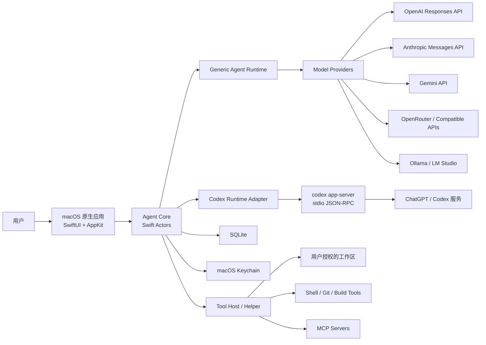
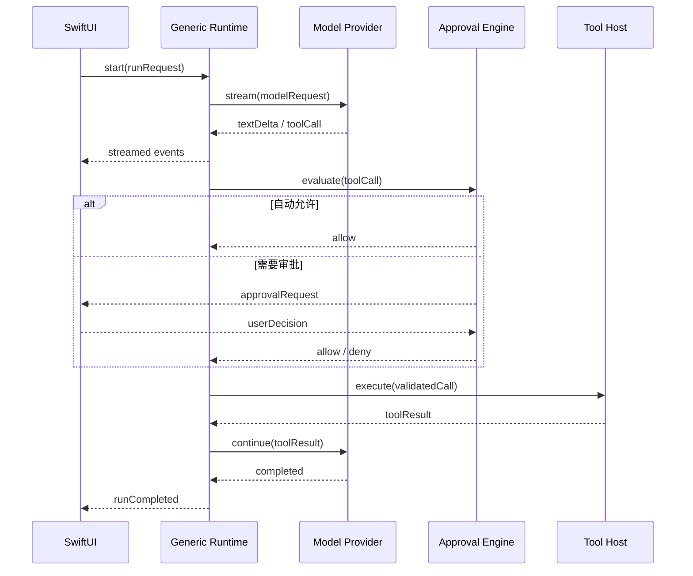
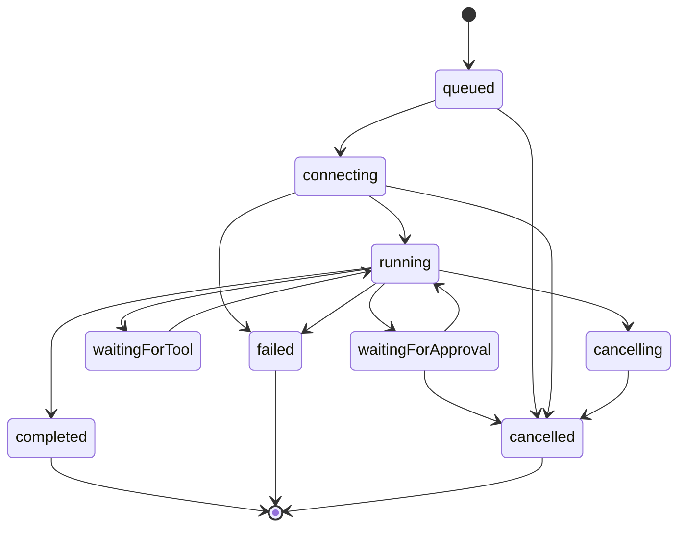

# macOS 原生多模型 Agent：产品计划与技术架构

版本：0.2

日期：2026-08-08

状态：架构蓝图；coding agent 纵向切片实施中

当前仓库的详细差距、目标接口、Codex 协议映射、审批与安全规则、持久化设计、分阶段任务和验收标准见 [`coding-agent-implementation-plan.md`](./coding-agent-implementation-plan.md)。本文继续作为产品目标与总体架构的单一事实来源，实施细节以该文档为准。

## 1. 执行摘要

本项目拟开发一款 macOS 原生、多模型、以本地工作区为中心的 coding agent。应用使用 SwiftUI 与 AppKit 构建原生界面，以 Swift 编写统一的 Agent Core，通过 AsyncHTTPClient 接入 OpenAI、Anthropic、Gemini、OpenRouter、Ollama 等模型；ChatGPT/Codex 订阅不自行模拟内部协议，而是通过本地 `codex app-server` 的 JSON-RPC 接口接入。

架构的核心不是“为所有模型包装同一个聊天接口”，而是严格分离以下概念：

1. **Model Provider**：负责某个模型服务的认证、请求、流式协议和错误转换。
2. **Agent Runtime**：负责推理循环、工具调用、上下文、审批和任务状态。
3. **Tool Host**：负责在受控权限内读取文件、修改代码、执行命令和调用 MCP。
4. **Presentation**：负责项目、会话、流式事件、diff、终端和审批界面。

第一版建议采用“通用自研 Runtime + Codex Runtime Adapter”的双运行时架构：普通 API 模型使用自研工具循环；ChatGPT/Codex 订阅由 app-server 托管完整 Codex 运行时。这样既能支持多模型，又不需要复制 Codex 的认证、线程和审批实现。

## 2. 产品目标

### 2.1 目标用户

- 希望在一个原生 macOS 应用中切换多个模型的开发者。
- 已订阅 ChatGPT/Codex，希望复用订阅额度的用户。
- 使用自有 API Key、OpenRouter 或本地模型的高级用户。
- 重视本地文件控制、审批、透明执行记录和隐私边界的团队。

### 2.2 核心价值

- 一个项目可以按任务选择不同模型或运行时。
- 模型只提出工具调用，所有本地动作由受控 Tool Host 执行。
- 每次文件修改、命令执行和网络访问都有可观察、可取消、可审批的状态。
- API Key、ChatGPT 订阅和本地模型并存，计费与额度来源清晰分离。
- 应用保持 macOS 原生交互，不依赖 Electron。

### 2.3 第一版成功标准

- 能创建本地项目并选择一个或多个工作区目录。
- 能使用 OpenAI Platform API 和 ChatGPT/Codex 订阅完成真实 coding task。
- 能接入至少一个非 OpenAI 云模型和一个本地模型。
- 支持流式文本、工具调用、文件 diff、命令输出、取消和审批。
- 应用崩溃或重启后能够恢复会话及未完成任务的可解释状态。
- API Key 仅存 Keychain，日志不包含凭据和未授权的敏感文件内容。

## 3. 非目标与范围控制

第一版不包含：

- 云端同步和跨设备会话。
- 团队协作、组织权限和共享账单。
- 自建模型代理或代用户保管统一 API Key。
- 多 agent 自动编排。
- 浏览器/桌面 Computer Use。
- 插件市场和远程代码执行平台。
- 无人监督的高风险自动操作。
- Mac App Store 发布。

以上能力应在核心运行时、权限模型和事件协议稳定后再评估。

## 4. 关键架构决策

### ADR-001：Provider 与 Runtime 分离

模型服务和 agent 运行时是两个正交维度。OpenAI API Key、ChatGPT OAuth、Anthropic API 和 Ollama 是认证/传输差异；通用工具循环、Codex app-server 和未来的外部 agent 则是运行时差异。不得用一个 `provider` 枚举同时表达这两类概念。

### ADR-002：统一事件，不统一原始协议

内部统一 `ModelEvent` 与 `AgentEvent`，但保留 provider-specific 请求和响应类型。不得把 Responses API、Anthropic Messages 和 Gemini GenerateContent 强行降级成 Chat Completions 格式。

### ADR-003：Codex 订阅通过 app-server

ChatGPT/Codex 订阅使用 `codex app-server`，Swift 客户端通过 stdio JSONL/JSON-RPC 与其通信。应用不读取或复制 `~/.codex/auth.json`，不复用第三方 OAuth client ID，也不自行依赖未公开的认证字段。

### ADR-004：直连 Provider 使用 AsyncHTTPClient

Agent Core 进程复用一个长生命周期 `HTTPClient`。所有 SwiftNIO 类型限定在 `HTTPTransport` 实现内部；上层只接触 `Data`、领域请求和异步事件流。

### ADR-005：本地工具隔离执行

UI 和会话协调运行在主应用；Shell、Git 和文件写入由独立 Tool Host/helper 执行。所有工具调用必须带工作区、权限策略、超时和取消令牌。

### ADR-006：站外签名发布

完整 coding agent 需要项目文件、命令和 Git 权限，第一版采用 Developer ID 签名、公证和自动更新，不以 Mac App Store 沙箱为目标。即使不使用 App Sandbox，也必须实现应用自身的最小权限边界。

## 5. 系统上下文



## 6. 运行时架构

### 6.1 Generic Agent Runtime

自研 Runtime 用于 OpenAI Platform、Anthropic、Gemini、OpenRouter 和本地模型。它拥有以下职责：

- 构建系统指令、项目上下文和当前用户输入。
- 根据模型能力选择工具和请求参数。
- 消费模型流式事件。
- 将工具调用交给审批系统和 Tool Host。
- 将工具结果追加到上下文并继续模型循环。
- 控制最大轮数、Token 预算、取消、超时和错误恢复。
- 生成统一的运行事件和持久化检查点。

运行循环：



### 6.2 Codex Runtime Adapter

Codex Adapter 不重新实现 Codex 工具循环，而是：

- 启动和监控 `codex app-server` 子进程。
- 使用默认 stdio JSONL 传输 JSON-RPC 消息。
- 管理 request ID、thread ID、turn ID 和通知订阅。
- 将 app-server 事件转换为统一 `AgentEvent`。
- 将 app-server 审批请求映射到原生审批界面。
- 将登录 URL、登录状态和工作区选择呈现给用户。
- 在进程异常退出后恢复可恢复线程，无法恢复时给出明确状态。

第一版不使用 app-server WebSocket，因为当前官方文档将该传输标为实验能力；本机应用使用 stdio 更简单，也避免额外监听端口。

### 6.3 Runtime Router

路由必须由显式配置和能力决定，不能仅凭模型名称猜测：

| 场景 | Runtime | Credential |
|---|---|---|
| OpenAI Platform API | Generic | OpenAI API Key |
| ChatGPT/Codex 订阅 | Codex Adapter | app-server 管理的 ChatGPT 登录 |
| Anthropic API | Generic | Anthropic API Key |
| Gemini API | Generic | Google API Key/OAuth |
| OpenRouter | Generic | OpenRouter API Key |
| Ollama/LM Studio | Generic | 本地地址，可选认证 |

用户在新建会话时选择 Runtime 和 Model；会话创建后默认固定组合，切换模型需要生成新的运行检查点，防止不同协议的隐藏状态互相污染。

## 7. Swift 模块设计

建议使用 Xcode workspace 加多个本地 Swift Package：

```text
MacAgent.xcworkspace
├── App
│   ├── MacAgentApp
│   ├── Features
│   │   ├── Projects
│   │   ├── Chat
│   │   ├── DiffReview
│   │   ├── Terminal
│   │   ├── Approvals
│   │   └── Settings
│   └── AppKitBridges
├── Packages
│   ├── AgentDomain
│   ├── AgentCore
│   ├── AgentPersistence
│   ├── HTTPTransport
│   ├── ProviderOpenAI
│   ├── ProviderAnthropic
│   ├── ProviderGemini
│   ├── ProviderOpenAICompatible
│   ├── ProviderLocal
│   ├── RuntimeGeneric
│   ├── RuntimeCodex
│   ├── ToolProtocol
│   ├── ToolHostClient
│   └── MCPClient
└── Helpers
    └── ToolHost
```

模块依赖方向必须单向：

```text
App → AgentCore → AgentDomain
App → AgentPersistence
AgentCore → AgentRuntime protocols
RuntimeGeneric → ModelProvider protocols + ToolProtocol
RuntimeCodex → AppServerTransport + AgentDomain
Provider* → HTTPTransport + AgentDomain
ToolHostClient → ToolProtocol
```

Provider 之间不得互相依赖；UI 不得直接引用 AsyncHTTPClient、SwiftNIO 或 provider-specific DTO。

## 8. 核心协议

```swift
public protocol ModelProvider: Sendable {
    var descriptor: ProviderDescriptor { get }

    func models() async throws -> [ModelDescriptor]

    func stream(
        request: ModelRequest
    ) -> AsyncThrowingStream<ModelEvent, Error>
}

public protocol AgentRuntime: Sendable {
    func start(
        request: AgentRunRequest
    ) -> AsyncThrowingStream<AgentEvent, Error>

    func cancel(run_id: RunID) async
}

public protocol ToolExecutor: Sendable {
    func execute(
        call: ApprovedToolCall
    ) -> AsyncThrowingStream<ToolExecutionEvent, Error>
}
```

建议统一的模型事件：

```swift
public enum ModelEvent: Sendable {
    case responseStarted(ResponseMetadata)
    case textDelta(String)
    case reasoningSummaryDelta(String)
    case toolCallDelta(ToolCallDelta)
    case toolCallCompleted(ToolCall)
    case usage(UsageRecord)
    case completed(ModelResponse)
}
```

建议统一的 Agent 事件：

```swift
public enum AgentEvent: Sendable {
    case runStarted(RunSnapshot)
    case messageDelta(MessageDelta)
    case toolCallProposed(ToolCall)
    case approvalRequested(ApprovalRequest)
    case toolExecutionStarted(ToolExecutionSnapshot)
    case toolExecutionOutput(ToolOutputChunk)
    case fileDiffUpdated(FileDiff)
    case usageUpdated(UsageRecord)
    case runWaiting(RunWaitReason)
    case runCompleted(RunResult)
    case runFailed(AgentFailure)
}
```

## 9. HTTP 与流式协议

### 9.1 HTTPTransport

`HTTPTransport` 是内部抽象，第一版实现使用 AsyncHTTPClient：

- 整个 Agent Core 生命周期复用一个 `HTTPClient`。
- 应用退出时先取消任务、等待在途请求，再调用 `shutdown()`。
- Provider 只通过 `HTTPTransport` 发起请求，不直接创建 HTTPClient。
- NIO `ByteBuffer` 在 transport 边界转换为内部字节流。
- 每个请求包含连接超时、响应读取策略、取消句柄和 trace ID。

### 9.2 SSE 解析

模型流通常使用 SSE，但网络分片不等于 SSE 行或事件。解析器必须：

- 缓存不完整 UTF-8 字节。
- 处理一行跨多个 `ByteBuffer` 的情况。
- 支持 `event:`、`data:`、空行结束事件和多行 data。
- 忽略注释心跳。
- 限制单个事件和累计缓冲区大小。
- 在取消时立即停止读取并释放请求资源。
- 保存原始事件类型，但只向上层输出领域事件。

必须用随机分片测试验证，禁止仅用“每个 chunk 恰好一行”的 fixture。

### 9.3 重试规则

- DNS、连接和 TLS 失败可在尚未收到响应且请求可安全重放时有限重试。
- 收到任何模型输出后，不自动重放整个请求。
- 工具执行开始后，不得因为模型网络错误重复执行工具。
- 429 和 5xx 遵守服务端提示，并使用带抖动的有界退避。
- 认证错误不重试，直接要求刷新或重新登录。
- 每个 Provider 负责把 HTTP 错误转换为统一、可展示的 `ProviderFailure`。

## 10. Model Provider 设计

### 10.1 能力模型

```swift
public struct ModelCapabilities: Sendable, Codable {
    public let supports_tools: Bool
    public let supports_parallel_tools: Bool
    public let supports_vision: Bool
    public let supports_files: Bool
    public let supports_reasoning: Bool
    public let supports_structured_output: Bool
    public let supports_streaming: Bool
    public let context_window: Int?
    public let maximum_output_tokens: Int?
}
```

能力来自服务端模型列表、内置目录或用户配置。未知能力保持 unknown，不得猜测为支持。模型选择器仅展示当前 Runtime 能安全使用的能力组合。

### 10.2 OpenAI Provider

- 使用 Responses API，而不是新增依赖于 Chat Completions 的核心设计。
- 支持文本、图片输入、function tools、流式事件和 usage。
- API Key 从 Keychain 读取到请求内存，不写入数据库和日志。
- Platform API 与 ChatGPT/Codex 订阅显示为不同的认证来源。

### 10.3 OpenAI-Compatible Provider

兼容接口不能假定所有服务完全实现 OpenAI 行为。配置必须允许：

- Base URL。
- 自定义 Headers。
- 模型 ID 与显示名称映射。
- 是否支持 Responses 或仅支持 Chat Completions。
- 工具调用和 structured output 能力开关。
- TLS 和代理策略。

### 10.4 本地 Provider

第一版选择 Ollama，LM Studio 作为兼容 Provider。需要额外处理：

- 服务发现和健康检查。
- 模型下载不由应用隐式触发。
- 本地上下文窗口和工具能力可能不可靠。
- 用户必须明确知道数据留在本机还是由自定义 endpoint 处理。

## 11. 工具系统

### 11.1 第一版内置工具

- `filesystem.read`
- `filesystem.list`
- `filesystem.search`
- `filesystem.write`
- `filesystem.apply_patch`
- `shell.execute`
- `git.status`
- `git.diff`
- `git.log`
- `git.show`

Git 写操作不作为单独的无审批默认工具；需要时通过明确的 shell 审批执行。第一版不提供自动 push、删除分支或重写历史。

### 11.2 Tool Host 边界

Tool Host 接收结构化调用，不接收拼接后的 shell 字符串。命令工具至少包含：

- executable
- arguments
- working directory
- environment allowlist
- timeout
- output limit
- workspace scope

Tool Host 必须验证路径规范化后的真实位置，防止 `..`、符号链接和挂载点绕过工作区边界。

### 11.3 审批策略

```text
deny   → 永不执行
ask    → 每次向用户展示精确影响后执行
allow  → 在当前工作区和约束内自动执行
```

审批记录应绑定：工具名、规范化参数、工作区、会话、策略版本和过期时间。宽泛审批不得自动覆盖更高风险的参数变化。

默认策略：

- 读取已授权工作区：allow。
- 写入已授权工作区：ask，可按会话授权。
- 执行测试、lint 和只读 Git：ask，可按命令前缀授权。
- 网络访问、包安装、系统目录、凭据文件：ask 或 deny。
- 删除、覆盖、Git 历史修改、发布和外部消息：始终 ask。

### 11.4 MCP

MCP 作为后续 MVP 增量，但协议位置预留在 Tool Registry：

- MCP tool schema 转换为内部 `ToolDefinition`。
- 服务端身份、命令、URL 和授权状态持久化。
- 每个 MCP server 独立启动、超时、重连和禁用。
- 来自 MCP 的内容视为不可信工具输出，不得改变系统权限。

## 12. 权限与安全

### 12.1 凭据

- API Key、OAuth Token 和 app-server access token 存 Keychain。
- SQLite 只保存 Keychain reference 和非敏感元数据。
- 崩溃报告、日志和剪贴板不得包含完整凭据。
- UI 只显示凭据末尾少量字符用于识别。
- 导入/导出配置默认排除凭据。

### 12.2 文件安全

- 每个项目维护明确的 workspace roots。
- 默认拒绝读取 `.env`、SSH key、系统 Keychain 数据和浏览器配置。
- 用户可按路径临时授权，但 deny 规则优先。
- 文件写入先计算 diff；高风险覆盖必须审批。
- 临时文件使用系统临时目录并设置用户私有权限。

### 12.3 命令安全

- 使用 executable + arguments 启动进程，避免隐式 shell 解析。
- 只有用户明确要求 shell 语法时才通过登录 shell，并展示完整命令。
- 使用独立进程组，取消时终止完整进程树。
- 过滤敏感环境变量，仅传递必要的 PATH 和显式 allowlist。
- 输出有字节和行数上限，完整输出可写入受控日志文件。

### 12.4 Prompt Injection

- 文件、网页、命令输出和 MCP 内容均标记为 untrusted context。
- 工具输出不能提升工具权限或改变审批策略。
- 模型提出的“忽略规则”“上传凭据”等内容只作为文本处理。
- 涉及外发数据时，审批界面必须显示目标、数据类别和目的。

## 13. 数据模型与持久化

核心实体：

| Entity | 关键字段 |
|---|---|
| Project | id、name、workspace roots、permission policy |
| Conversation | id、project id、runtime id、model id、created at |
| Run | id、conversation id、state、started/completed at |
| Message | id、run id、role、ordered content parts |
| ToolCall | id、tool、arguments、approval state、result id |
| Approval | id、scope、decision、policy version、expires at |
| UsageRecord | provider、model、input/output units、cost source |
| CredentialRef | provider、Keychain reference、display metadata |
| EventCheckpoint | run id、sequence、serialized resumable state |

数据库使用显式 schema migration。大体积终端输出、图片和附件保存在应用支持目录，SQLite 只保存引用、哈希和元数据。

### 13.1 Run 状态机



每次状态变化先写事件，再更新聚合快照，确保崩溃后可以解释最后发生了什么。

## 14. 原生 macOS 界面

### 14.1 信息架构

- Sidebar：项目、最近会话和运行状态。
- Main：对话时间线、模型输出、工具调用和错误。
- Inspector：模型、Runtime、上下文、权限和使用量。
- Bottom panel：终端输出、测试、Git diff 和日志。
- Modal/Sheet：登录、Provider 配置、危险操作审批。

### 14.2 必须原生处理的交互

- `NSOpenPanel` 选择工作区。
- Keychain 凭据存储。
- `NSTextView`/TextKit 处理大型流式文本和代码选择。
- Diff 使用虚拟化列表或高效文本布局，避免把大 diff 直接堆入 SwiftUI Text。
- 终端需要 VT 解析器与 AppKit 视图，不用简单 Text 模拟。
- 菜单、快捷键、窗口恢复和多窗口遵循 macOS 习惯。

### 14.3 流式 UI 策略

- 网络事件不直接逐 token 触发全树刷新。
- Agent Core 聚合短时间窗口内的 delta，再由 MainActor 批量提交。
- 会话列表、消息内容和终端输出使用独立 observable state。
- 大型输出写入 ring buffer/文件，UI 只渲染可见窗口。

## 15. 可观测性与诊断

- 每个 Run、Provider request、ToolCall 和 app-server request 使用关联 ID。
- 使用 `Logger`/OSLog 记录结构化事件，默认脱敏。
- 使用 signpost 测量首 token 延迟、工具耗时、UI 提交和数据库写入。
- 设置中提供诊断包导出，默认排除 prompt、文件内容和凭据。
- 展示 Provider 原始错误代码与经过整理的用户提示。
- 分别统计 Platform API 计费、ChatGPT/Codex 订阅配额和本地模型使用，不混算。

## 16. 测试策略

### 16.1 单元测试

- SSE 任意字节分片、UTF-8 边界、多行 data 和异常结束。
- Provider DTO 与领域事件转换。
- Agent 状态机和最大工具轮数。
- 路径规范化、符号链接和 deny 规则。
- 审批 scope 匹配。
- Token/密钥脱敏。

### 16.2 合约测试

- 使用本地 mock HTTP server 回放真实脱敏响应 fixture。
- 验证 OpenAI、Anthropic、Gemini 和兼容 Provider 的流式协议。
- 对 provider schema 变化设置 golden tests。
- app-server 使用固定版本二进制运行 JSON-RPC 合约测试。

### 16.3 集成测试

- 从用户输入到工具执行再到最终回答的完整循环。
- 取消模型流、取消工具进程和应用退出。
- app-server 登录、线程创建、审批和恢复。
- Keychain 创建、读取、更新和删除。
- SQLite migration 与崩溃恢复。

### 16.4 安全测试

- Shell argument injection。
- 路径穿越和符号链接逃逸。
- 恶意 MCP/tool 输出诱导提权。
- 日志和诊断包凭据扫描。
- 超大输出、无限流和压缩炸弹。

## 17. 交付计划

以下为单名熟悉 Swift 的工程师全职开发估算；设计和测试资源可缩短总周期。

### Phase 0：技术验证，3–5 天

- 建立 Swift workspace 和本地 Package 边界。
- 验证 AsyncHTTPClient 流式 SSE。
- 验证启动 `codex app-server` 并接收 JSON-RPC 通知。
- 验证 Tool Host 启动进程、取消进程树和捕获输出。

退出条件：三个最危险的技术点都有最小可运行原型。

### Phase 1：应用骨架，1 周

- 项目、会话、设置和窗口结构。
- AgentDomain、事件总线、Run 状态机。
- SQLite 和 Keychain 基础设施。
- 基础日志与错误展示。

退出条件：可创建项目、会话并持久化空运行。

### Phase 2：OpenAI Platform Provider，1–2 周

- HTTPTransport 与 AsyncHTTPClient 生命周期。
- Responses API 请求、SSE、文本和 tool call。
- 模型目录、能力和 API Key 设置。
- 使用量与错误映射。

退出条件：无工具和单工具任务均能完成，取消可靠。

### Phase 3：Generic Runtime 与 Tool Host，2 周

- 通用工具循环。
- 文件读取、搜索、patch、shell 和只读 Git。
- 原生审批 UI 和策略。
- Diff 与终端输出。

退出条件：可以在测试仓库中完成修改并运行测试，全程可审查。

### Phase 4：Codex Runtime，1–2 周

- app-server 进程管理和 JSON-RPC client。
- ChatGPT 登录状态。
- thread/turn/event 映射。
- 审批、diff、工具输出和恢复。

退出条件：用户可使用 ChatGPT/Codex 订阅完成与 Platform Provider 等价的核心任务。

### Phase 5：多模型扩展，2 周

- Anthropic Provider。
- OpenAI-Compatible/OpenRouter Provider。
- Ollama 本地 Provider。
- 模型能力矩阵和会话路由。

退出条件：至少三个云端来源和一个本地来源通过合约测试。

### Phase 6：安全与稳定性，2 周

- Tool Host 隔离、路径和环境策略。
- 崩溃恢复、重试、诊断和性能优化。
- 大上下文、大 diff、长命令压力测试。
- 更新、签名和公证流水线。

退出条件：安全检查清单通过，已知高风险行为均需明确审批。

### Phase 7：封闭 Beta，1–2 周

- 真实项目 dogfooding。
- Provider 兼容性修复。
- onboarding、错误恢复和文档。
- 收集首 token、任务成功率、取消成功率和崩溃率。

总估算：约 10–13 周。

## 18. MVP Backlog

### P0

- 项目和工作区授权。
- OpenAI Responses Provider。
- Codex app-server Runtime。
- 通用 Agent Runtime。
- 文件 read/search/apply patch。
- Shell 执行、取消和审批。
- Diff、终端输出、会话恢复。
- Keychain、SQLite、结构化日志。

### P1

- Anthropic、OpenRouter、Ollama。
- MCP stdio client。
- 自定义 Provider。
- 运行模板和项目指令。
- 上下文压缩和附件。
- 成本/配额视图。

### P2

- 多 agent 编排。
- 浏览器工具。
- 云同步和远程执行。
- 团队策略和共享配置。
- 插件市场。

## 19. 风险与缓解

| 风险 | 影响 | 缓解 |
|---|---|---|
| Provider 流式协议变化 | 请求或解析失败 | Provider 隔离、fixture、合约测试 |
| app-server 实验字段变化 | Codex 集成回归 | 固定兼容版本、能力握手、协议测试 |
| 工具误操作 | 用户代码或数据损失 | 最小权限、diff、审批、工作区限制 |
| UI 被高频 token 拖慢 | 输入卡顿、内存增长 | delta 批处理、虚拟化、输出上限 |
| API Key 泄漏 | 账户与费用风险 | Keychain、脱敏、诊断扫描 |
| 模型能力误判 | 工具调用失败 | 能力目录、unknown 状态、显式覆盖 |
| 自动重试重复工具 | 重复写入或外部副作用 | 模型请求和工具执行分阶段、禁止盲重放 |
| 多 Provider 抽象过度 | 功能被最低公分母限制 | 统一事件、保留 provider-specific DTO |

## 20. 发布与运维

- Developer ID Application 签名和 Apple 公证。
- 更新包签名并支持回滚到上一稳定版本。
- Codex runtime 版本随应用发布记录；升级前运行协议合约测试。
- 第三方 Swift Package 使用锁定版本和依赖审计。
- 隐私声明明确区分本地模型、直连 Provider 和 ChatGPT/Codex 数据路径。
- 默认关闭原始 prompt 日志和遥测；诊断数据必须用户主动提交。

## 21. 立项前必须确认的产品决策

1. 最低 macOS 版本；建议以 macOS 14+、Swift 6.1 为初始技术基线验证。
2. 第一版是否只支持用户自带凭据，不提供统一云端代理。
3. 是否允许应用执行任意 shell，或仅运行预定义开发命令。
4. Codex 二进制由应用捆绑，还是要求用户单独安装；建议最终捆绑并固定兼容版本，但需完成许可证、签名和更新审查。
5. 第一版非 OpenAI Provider 选择；建议 Anthropic + OpenRouter + Ollama。
6. 是否需要真正的终端模拟器；若只展示命令日志，可延后完整 PTY。

## 22. 建议的第一步

先做一个不含正式 UI 的技术验证程序，只完成三条链路：

1. AsyncHTTPClient → OpenAI Responses SSE → 统一 `ModelEvent`。
2. Swift Process → `codex app-server` → JSON-RPC → 统一 `AgentEvent`。
3. 结构化 ToolCall → 审批 → Tool Host → tool result。

这三条链路验证成功后再建设完整 SwiftUI 界面，可以最早暴露协议、取消、进程管理和权限边界问题。

当前代码已经完成第 2 条链路中的 app-server 子进程、握手、thread/turn、文本/推理事件和 thread 恢复，但尚未接入工作区、命令/文件 item、审批、diff 和丰富持久化。下一阶段不再按孤立技术点推进，而按 [`coding-agent-implementation-plan.md`](./coding-agent-implementation-plan.md) 的 Phase A～C 完成第一条 Codex coding agent 纵向闭环；随后再按 Phase D～E 实现 Generic Runtime 与独立 Tool Host。

## 23. 参考资料

- [OpenAI Codex App Server](https://learn.chatgpt.com/docs/app-server)
- [OpenAI Codex SDK](https://learn.chatgpt.com/docs/codex-sdk)
- [OpenAI Responses API 与 Agents SDK](https://developers.openai.com/api/docs/guides/agents#agents-sdk-vs-responses-api)
- [OpenAI Function Calling](https://developers.openai.com/api/docs/guides/function-calling)
- [OpenAI SDK 与社区 Swift 库](https://developers.openai.com/api/docs/libraries#swift)
- [Swift AsyncHTTPClient](https://github.com/swift-server/async-http-client)
